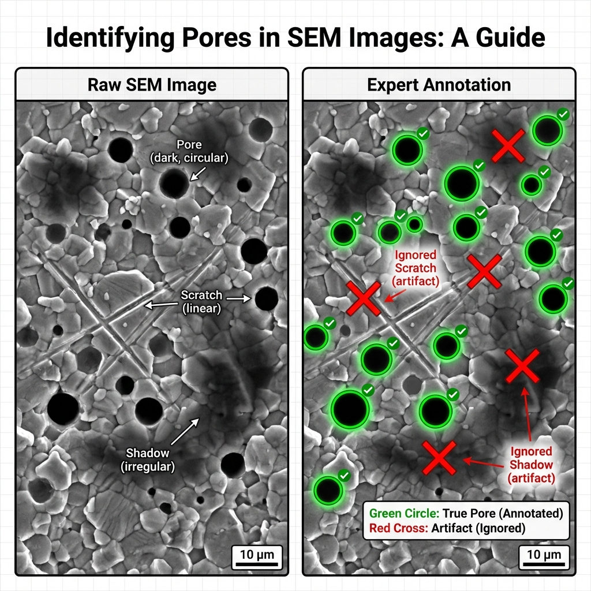
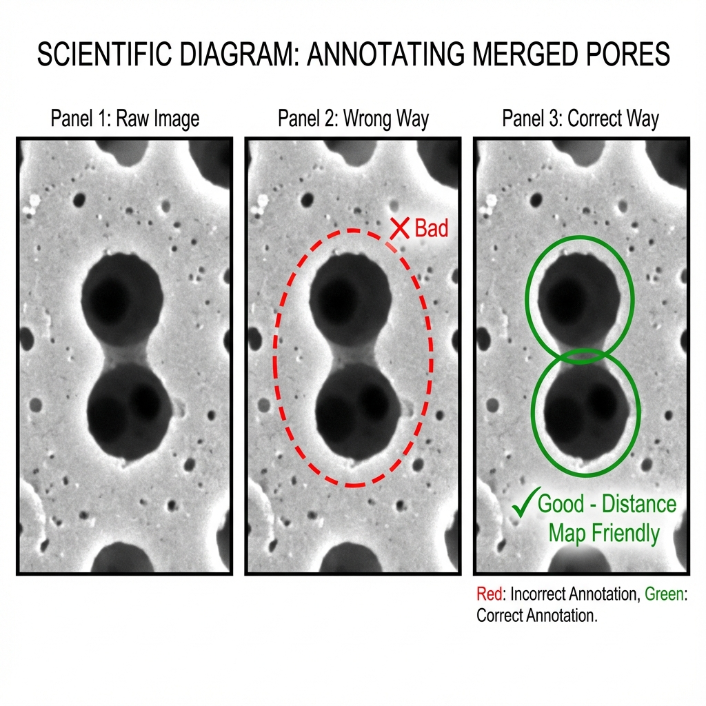
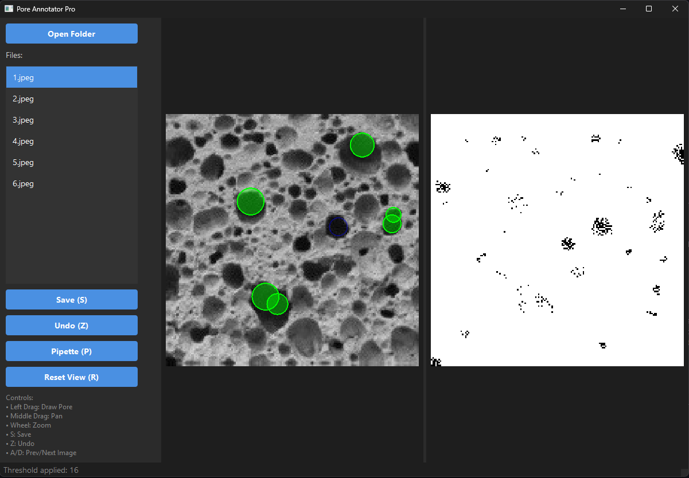
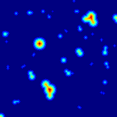
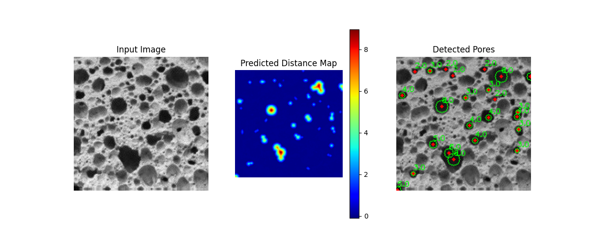

# Pore Analysis AI: Полное руководство

Этот проект предназначен для автоматического обнаружения и анализа пор на SEM-изображениях керамики с использованием глубокого обучения (Regression UNet).

---

## 0. Установка и Запуск

Перед началом работы необходимо подготовить окружение.

1.  **Создайте виртуальное окружение:**
    ```bash
    python -m venv .venv
    .venv\Scripts\activate
    ```

2.  **Установите зависимости:**
    ```bash
    pip install -r requirements.txt
    ```
    *Для работы с GPU (NVIDIA) убедитесь, что установлен PyTorch с поддержкой CUDA.*

3.  **Скачайте датасет:**
    Для быстрого старта вы можете скачать готовый набор данных:
    [Google Drive Link](https://drive.google.com/file/d/1D3RilH6dyAzNCyiDUmFHEfnJkgg7rz6o/view?usp=sharing)

---

## 1. Правила разметки и Инструменты

Для обучения нейросети нам нужны качественные данные. Мы используем специальную утилиту для ручной разметки.

### Как определить пору?
*   **Контраст:** Поры обычно темнее фона.
*   **Форма:** Округлые или неправильные формы, но с видимой "глубиной".
*   **Игнорируйте:** Царапины, тени от поверхности, неглубокие текстуры.



### Правило "Перешейка" (The Neck Rule)
Как отличить одну слипшуюся пору от двух разных?
*   **Одна пора:** Форма овальная или бобовидная, но без сужения.
*   **Две поры:** Виден "перешеек" (сужение) между центрами. Размечайте их как два перекрывающихся круга.



### Инструмент разметки (Annotator Tool)
Мы разработали удобный GUI-инструмент для разметки.

**Запуск:**
```bash
python tools/annotator/main.py
```

**Интерфейс:**


**Функции:**
*   **Рисование:** Левая кнопка мыши (тяните для радиуса).
*   **Навигация:** Средняя кнопка (или Пробел + ЛКМ) для панорамирования, Колесо для зума.
*   **Пипетка (P):** Кликните на пору, чтобы увидеть маску по порогу яркости (помогает отделить пору от фона).
*   **Split View:** Слева список, по центру оригинал, справа предпросмотр эффектов.
*   **Сохранение (S):** Сохраняет оригинал, маску и карту расстояний.

> [!IMPORTANT]
> **Человеческий фактор и Экспертная оценка**
> 
> Результаты работы нейросети напрямую зависят от качества разметки. Ошибки человека станут ошибками модели.
> *   **Экспертный контроль:** Крайне рекомендуется, чтобы разметку выполнял или проверял профильный специалист (химик/материаловед), понимающий структуру материала.
> *   **Active Learning (Активное обучение):** Для достижения идеальных результатов используйте итеративный подход:
>     1. Разметьте 10-20 изображений.
>     2. Обучите модель.
>     3. Используйте модель для предразметки новых данных.
>     4. Эксперт исправляет ошибки модели.
>     5. Повторите обучение.
>     Такой цикл "разметка -> обучение -> проверка" каждые 10 изображений значительно ускоряет процесс и повышает точность.

---

## 2. Концепция Distance Map

Вместо обычной черно-белой маски (где 1 = пора, 0 = фон), мы генерируем **Distance Map** (Карту Расстояний).

*   **Что это:** Значение каждого пикселя равно расстоянию до ближайшей границы поры. Центр поры — самый яркий (пик).
*   **Зачем:**
    1.  **Разделение слипшихся пор:** На обычной маске две слипшиеся поры — это одно пятно. На карте расстояний это **два разных пика**.
    2.  **Обучение:** Нейросети проще предсказывать плавный градиент значений, чем резкие границы.



---

## 3. Аугментация данных (Размножение)

Размечать тысячи фото вручную долго. Мы берем небольшой набор (например, 6-10 фото) и "размножаем" его.

**Скрипт:** `scripts/augment_data.py`

**Методы:**
1.  **Геометрия:** Повороты (90°, 180°, 270°), Отражения (по горизонтали/вертикали).
2.  **Интенсивность:** Изменение яркости, контраста, добавление шума, размытие, гамма-коррекция.

**Результат:** Из 6 фото мы получаем **384 вариации** для обучения.

**Запуск:**
```bash
python scripts/augment_data.py
```

---

## 4. Обучение Нейросети

Мы используем архитектуру **UNet**, адаптированную для регрессии.

*   **Вход:** Черно-белое изображение (1 канал).
*   **Выход:** Distance Map (1 канал).
*   **Функция потерь:** MSE (Mean Squared Error).

**Запуск обучения:**
```bash
python models/regression/train.py
```

**Результаты обучения (пример):**
```text
Epoch 50: Train Loss=0.0089, Val Loss=0.0105
```
Низкое значение Loss (ошибка ~0.01) говорит о высокой точности модели.

---

## 5. Результаты работы

После обучения модель может предсказывать поры на новых изображениях.

**Запуск теста:**
```bash
python models/regression/inference.py --input "path/to/image.png"
```

**Пример работы:**


Слева — входное фото. В центре — предсказанная карта расстояний (тепловая карта). Справа — найденные поры (зеленые круги).

---

**Работу выполнил Ищенко Никита Николаевич магистр 2 курса ФИТУ ЮРГПУ(НПИ)**
