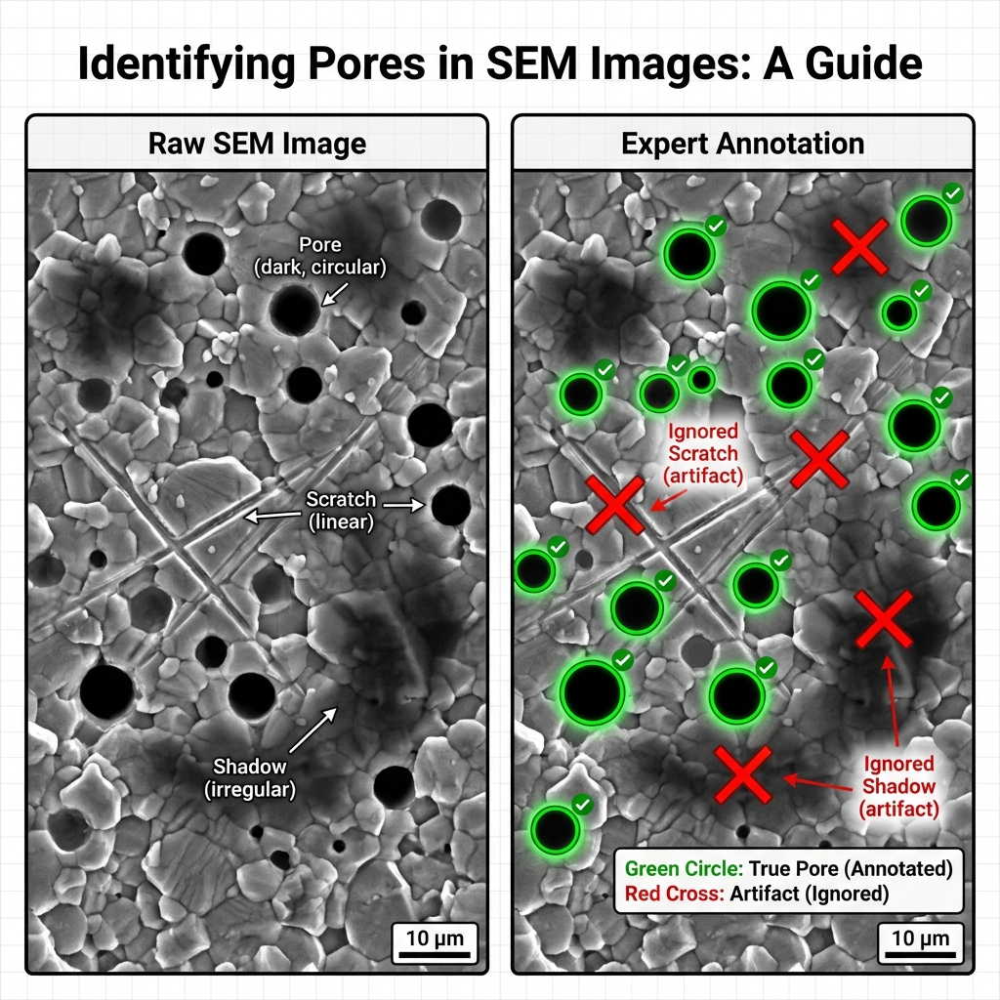
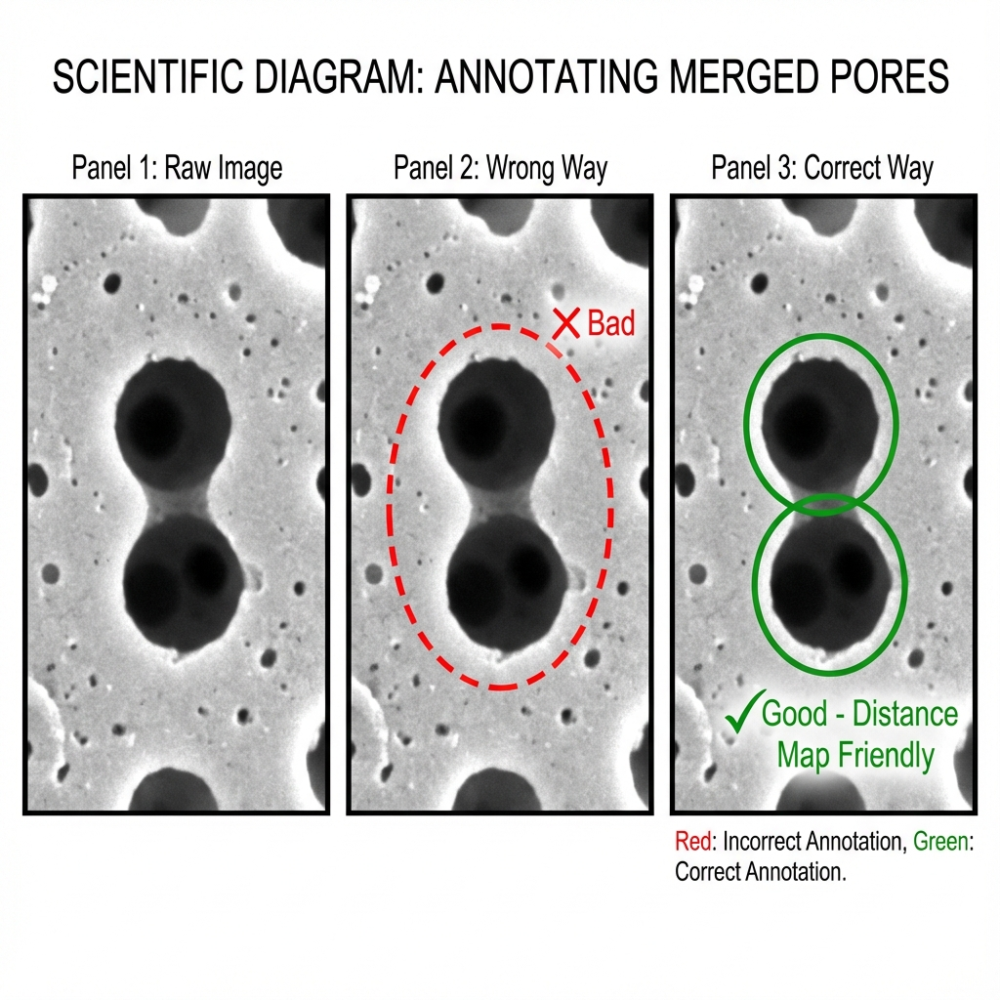
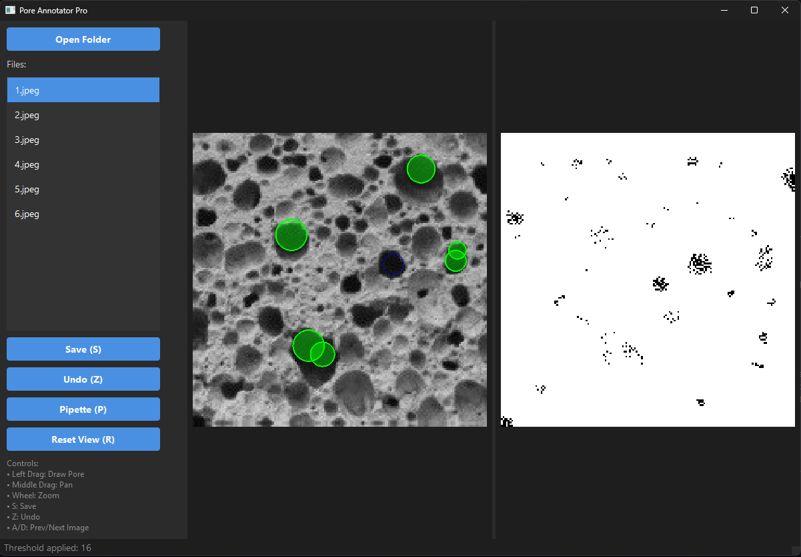
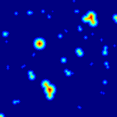
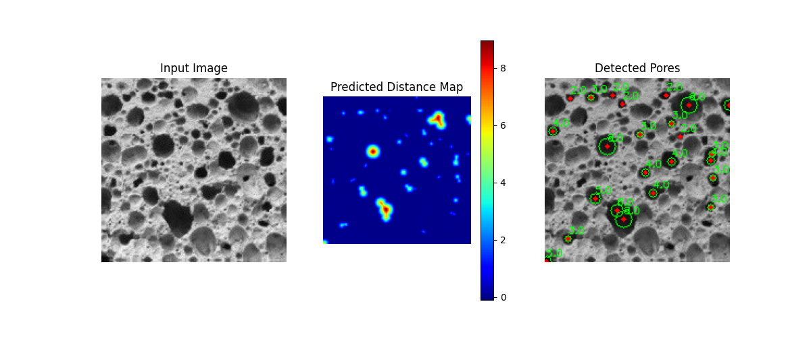

Here is the **English translation**:

---

# Pore Analysis AI: Complete Guide

This project is designed for automatic detection and analysis of pores in ceramic SEM images using deep learning (Regression UNet).

---

## 0. Installation and Setup

Before starting, you need to prepare the environment.

1. **Create a virtual environment:**

   ```bash
   python -m venv .venv
   .venv\Scripts\activate
   ```

2. **Install dependencies:**

   ```bash
   pip install -r requirements.txt
   ```

   *For GPU support (NVIDIA), make sure PyTorch with CUDA is installed.*

3. **Download the dataset:**
   For a quick start, you can download a ready-made dataset:
   [Google Drive Link](https://drive.google.com/file/d/1D3RilH6dyAzNCyiDUmFHEfnJkgg7rz6o/view?usp=sharing)

---

## 1. Annotation Rules and Tools

High-quality annotations are required to train the neural network. We use a dedicated manual annotation tool.

### How to identify a pore?

* **Contrast:** Pores are usually darker than the background.
* **Shape:** Rounded or irregular shapes with visible “depth.”
* **Ignore:** Scratches, surface shadows, shallow textures.



### The “Neck Rule”

How to distinguish one merged pore from two separate pores?

* **Single pore:** Oval or bean-like shape without narrowing.
* **Two pores:** A visible “neck” (constriction) between centers. Annotate them as two overlapping circles.



### Annotation Tool (Annotator Tool)

We developed a convenient GUI tool for annotation.

**Launch:**

```bash
python tools/annotator/main.py
```

**Interface:**


**Features:**

* **Drawing:** Left mouse button (drag to set radius).
* **Navigation:** Middle mouse button (or Space + LMB) to pan, scroll wheel to zoom.
* **Eyedropper (P):** Click on a pore to view a threshold-based mask (helps separate the pore from the background).
* **Split View:** List on the left, original image in the center, effect preview on the right.
* **Save (S):** Saves the original image, mask, and distance map.

> [!CAUTION]
> **Save your progress!**
>
> Before switching to the next image, always press **Save (S)**.
> Otherwise, the current annotation **will not be saved** and will be lost.

> [!IMPORTANT]
> **Human Factor and Expert Validation**
>
> The neural network’s performance directly depends on annotation quality. Human errors become model errors.
>
> * **Expert review:** It is strongly recommended that annotations be performed or reviewed by a domain expert (chemist/materials scientist) who understands the material structure.
> * **Active Learning:** To achieve optimal results, use an iterative approach:
>
>   1. Annotate 10–20 images.
>   2. Train the model.
>   3. Use the model to pre-annotate new data.
>   4. An expert corrects the model’s mistakes.
>   5. Retrain the model.
>
>   This “annotate → train → review” cycle every 10 images significantly speeds up the process and improves accuracy.

---

## 2. Distance Map Concept

Instead of a standard binary mask (1 = pore, 0 = background), we generate a **Distance Map**.

* **What it is:** Each pixel value represents the distance to the nearest pore boundary. The pore center is the brightest (peak).
* **Why it’s useful:**

  1. **Separating merged pores:** In a binary mask, merged pores appear as one blob. In a distance map, they form **two distinct peaks**.
  2. **Training stability:** Neural networks learn smooth gradients more easily than sharp edges.



---

## 3. Data Augmentation

Manually annotating thousands of images is time-consuming. We take a small dataset (e.g., 6–10 images) and “multiply” it.

**Script:** `scripts/augment_data.py`

**Methods:**

1. **Geometry:** Rotations (90°, 180°, 270°), horizontal/vertical flips.
2. **Intensity:** Brightness and contrast adjustments, noise addition, blur, gamma correction.

**Result:** From 6 images, we obtain **384 training variations**.

**Run:**

```bash
python scripts/augment_data.py
```

---

## 4. Neural Network Training

We use a **UNet** architecture adapted for regression.

* **Input:** Grayscale image (1 channel).
* **Output:** Distance Map (1 channel).
* **Loss function:** MSE (Mean Squared Error).

**Start training:**

```bash
python models/regression/train.py
```

**Training results (example):**

```text
Epoch 50: Train Loss=0.0089, Val Loss=0.0105
```

A low loss value (~0.01) indicates high model accuracy.

---

## 5. Results

After training, the model can predict pores on new images.

**Run inference:**

```bash
python models/regression/inference.py --input "path/to/image.png"
```

**Example output:**


Left — input image.
Center — predicted distance map (heatmap).
Right — detected pores (green circles).
